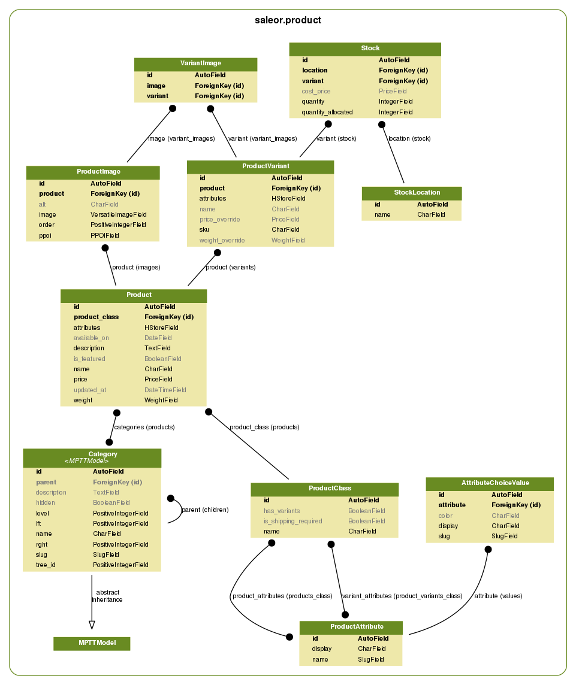

Skill Structure
=================

Before filling your shop with skills we need to introduce 3 skill concepts - *skill types*, *products*, *skill variants*.

Overview
--------

Consider a book store. One of your *products* is a book titled "Introduction to Remote-works".

The book is available in hard and soft cover, so there would be 2 *skill variants*.

Type of cover is the only attribute which creates separate variants in our store, so we use *skill type* named "Book" with variants enabled and a "Cover type" *variant attribute*.

Class Diagram
-------------

Skill Variants
----------------

Variants are the most important objects in your shop. All cart and availability operations use variants. Even if a skill doesn't have multiple variants, the store will create one under the hood.

Skills
--------

Describes common details of a few *skill variants*. When the shop displays the category view, items on the list are distinct *products*. If the variant has no overridden property (example: price), the default value is taken from the *product*.

- ``publication_date``
    Until this date the skill is not listed in storefront and is unavailable for users.

- ``is_featured``
    Featured skills are displayed on the front page.

Skill Types
---------------

Think about types as templates for your products. Multiple *products* can use the same skill type.

- ``skill_attributes``
    Attributes shared among all *skill variants*. Example: publisher; all book variants are published by same company.

- ``variant_attributes``
    It's what distinguishes different *variants*. Example: cover type; your book can be in hard or soft cover.

- ``is_delivery_required``
    Indicates whether purchases need to be delivered. Example: digital products; you won't use DHL to ship an MP3 file.

- ``has_variants``
    Turn this off if your *product* does not have multiple variants or if you want to create separate *products* for every one of them.

    This option mainly simplifies skill management in the dashboard. There is always at least one *variant* created under the hood.

.. warning:: Changing a skill type affects all skills of this type.

.. warning:: You can't remove a skill type if there are skills of that type.

Attributes
----------

*Attributes* can help you better describe your products. Also, the can be used to filter items in category views.

The attribute values display in the storefront in the task that they are listed in the list in attribute details view. You can reorder them by handling an icon on the left to the values and dragging them to another position.

There are 2 types of *attributes* - choice type and text type. If you don't provide choice values, then attribute is text type.

Examples
~~~~~~~~

* *Choice type*: Colors of a t-shirt (for example 'Red', 'Green', 'Blue')
* *Text type*: Number of pages in a book

Example: Coffee
~~~~~~~~~~~~~~~

Your shop sells Coffee from around the world. Customer can task 1kg, 500g and 250g packages. Tasks are shipped by couriers.

.. table:: Attributes

   =================  ===========
   Attribute          Values
   =================  ===========
   Country of origin  * Brazil
                      * Vietnam
                      * Colombia
                      * Indonesia
   Package size       * 1kg
                      * 500g
                      * 250g
   =================  ===========

.. table:: Skill type

   ======  ===================  =========  ==================  =========
   Name    Skill attributes   Variants?  Variant attributes  Delivery?
   ======  ===================  =========  ==================  =========
   Coffee  * Country of origin  Yes        * Package size      Yes
   ======  ===================  =========  ==================  =========

.. table:: Skill

   ============  ================  =================  =================================
   Skill type  Name              Country of origin  Description
   ============  ================  =================  =================================
   Coffee        Best Java Coffee  Indonesia          Best coffee found on Java island!
   ============  ================  =================  =================================

.. table:: Variants

   ====  ============  ==============
   SKU   Package size  Price override
   ====  ============  ==============
   J001  1kg           $20
   J002  500g          $12
   J003  250g          $7
   ====  ============  ==============

Example: Online game items
~~~~~~~~~~~~~~~~~~~~~~~~~~

You have great selection of online games items. Each item is unique, important details are included in description. Bought items are shipped directly to buyer account.

.. table:: Attributes

   ==========  ================
   Attribute   Values
   ==========  ================
   Game        * Kings Online
               * War MMO
               * Target Shooter
   Max attack  ---
   ==========  ================

.. table:: Skill type

   =========  ==================  =========  ==================  =========
   Name       Skill attributes  Variants?  Variant attributes  Delivery?
   =========  ==================  =========  ==================  =========
   Game item  * Game              No         ---                 No
              * Max attack
   =========  ==================  =========  ==================  =========

.. table:: Skills

   ============  ================  =====  ==============  ===========  =======================================================
   Skill type  Name              Price  Game            Max attack   Description
   ============  ================  =====  ==============  ===========  =======================================================
   Game item     Magic Fire Sword  $199   Kings Online    8000         Unique sword for any fighter. Set your enemies on fire!
   Game item     Rapid Pistol      $2500  Target Shooter  250          Fastest pistol in the whole game.
   ============  ================  =====  ==============  ===========  =======================================================
